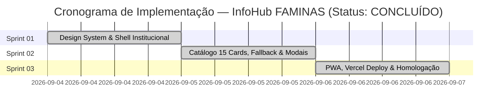

# IMPLEMENTATION_PLAN.md — INFOHUB FAMINAS

---

## 1. VISÃO DO ROADMAP E CRONOLOGIA DE ENTREGAS
O plano de implementação do **InfoHub FAMINAS** foi executado com sucesso em **3 Sprints Sequenciais**, todas 100% concluídas e validadas.

---

## 2. DETALHAMENTO DAS SPRINTS EXECUTADAS

### SPRINT 01: FUNDAÇÃO VISUAL INSTITUCIONAL & DESIGN SYSTEM
* **Status:** CONCLUÍDA (100%)
* **Objetivo:** Estabelecer o Design System oficial FAMINAS/EducaHub, tipografia, tokens de cor, cabeçalho institucional com atalho para o site oficial e a estrutura semântica base.
* **Marcos de Entrega (Milestone 1 - ALCANÇADO):** Shell visual institucional responsivo e aprovado.
* **Entregas Técnicas Validadas:**
  1. [x] Estruturação da árvore de diretórios (`/public`, `/src/css`, `/src/js`, `/tests`).
  2. [x] Arquivo de tokens de design `src/css/variables.css` espelhando a paleta oficial da FAMINAS e do EducaHub.
  3. [x] Reset semântico e tipografia com Google Fonts em `src/css/base.css`.
  4. [x] Cabeçalho institucional com a logomarca da FAMINAS e botão em destaque direcionando para `https://www.unifaminas.edu.br/principal` com `target="_blank" rel="noopener noreferrer"`.
  5. [x] Seção Hero institucional apresentando a extensão acadêmica de ADS/Engenharia de Software.
  6. [x] Rodapé institucional com botões acessíveis para modais e créditos acadêmicos.

---

### SPRINT 02: CATÁLOGO DOS 15 SETORES, MODAIS DESLIZANTES & FALLBACK
* **Status:** CONCLUÍDA (100%)
* **Objetivo:** Implementar o catálogo dinâmico declarativo com os 15 temas setoriais, grid 5x3 no desktop / 1 coluna no mobile, sistema de modais sobrepostos para textos legais/institucionais e aviso de indisponibilidade com opção de retorno.
* **Marcos de Entrega (Milestone 2 - ALCANÇADO):** Catálogo de 15 cards interativo e modais institucionais 100% operacionais.
* **Entregas Técnicas Validadas:**
  1. [x] Catálogo declarativo em `src/js/services-data.js` contendo os 15 setores oficiais do Guia de Extensão.
  2. [x] Motor de renderização dinâmica `src/js/cards-renderer.js` com suporte a teclado e atributos acessíveis.
  3. [x] Regras de CSS Grid em `src/css/cards.css` com 3 colunas fixas no desktop (matriz 5x3) e 1 coluna vertical no mobile.
  4. [x] Módulo `src/js/modal-controller.js` e estilos `src/css/modais.css` com suporte a drawers móveis, backdrop blur, bloqueio de scroll e tecla `Escape`.
  5. [x] Modais com textos completos: *Sobre o Projeto*, *Termos de Uso*, *Política de Privacidade / LGPD* e *Aviso de Homologação Discente com botão de retorno à tela inicial*.

---

### SPRINT 03: RECURSOS PWA, CONEXÃO OFFLINE, DEPLOY VERCEL & AUDITORIA
* **Status:** CONCLUÍDA (100%)
* **Objetivo:** Adicionar capacidade de aplicativo móvel instalável (PWA), suporte a funcionamento offline para o shell da aplicação, configuração para deploy na Vercel e validação de acessibilidade e performance.
* **Marcos de Entrega (Milestone 3 - ALCANÇADO):** PWA pronto para produção na Vercel e instalável em smartphones e desktops.
* **Entregas Técnicas Validadas:**
  1. [x] Manifesto PWA completo em `public/manifest.json` com ícones em alta resolução (192x192, 512x512 e SVG).
  2. [x] Service Worker `sw.js` com pré-cache e estratégia *Stale-While-Revalidate* e suporte offline.
  3. [x] Módulo `src/js/pwa.js` e badge institucional interativo *"Instalar App"* acionado via `beforeinstallprompt` ou drawer de instruções guiadas.
  4. [x] Configuração `vercel.json` com headers de segurança (`nosniff`, `SAMEORIGIN`, `strict-origin-when-cross-origin`) e invalidação de cache para o Service Worker.
  5. [x] Documentação técnica e manual de governança no [README.md](file:///c:/Users/Nilton/Workspaces/AG_Workspace/InfoHub-Faminas/README.md).
  6. [x] Suíte de testes automatizados via Vitest com 100% de taxa de aprovação (20 testes).

---

### SPRINT DE REFINAMENTO (PÓS-SPRINT 03): UX MOBILE & FIDELIDADE INSTITUCIONAL
* **Status:** CONCLUÍDA (100%)
* **Objetivo:** Otimizar o cabeçalho para viewports móveis estreitas ($\le 375\text{px}$), migrar o gatilho de instalação do PWA para o Hero com destaque visual pulsante, aplicar fundo branco de alto contraste na barra superior e incluir card de destaque para o curso de ADS no rodapé.
* **Entregas Técnicas Validadas:**
  1. [x] Realocação do botão "Instalar App" para o Hero (`.hero-badges-group`), eliminando esmagamento do logotipo no mobile e destacando a chamada com gradiente ciano e animação pulsante.
  2. [x] Renomeação do atalho institucional para *"Portal FAMINAS"* com flexibilidade responsiva via `.btn-text-full` e `.btn-text-short`.
  3. [x] Barra superior atualizada para fundo branco puro (`#FFFFFF`) com tipografia marinho escura (`#0B1B29`), subtítulo azul (`#005691`) e metatag `theme-color` sincronizada.
  4. [x] Inclusão de card de destaque no rodapé direcionando para a página oficial do curso de Análise e Desenvolvimento de Sistemas da FAMINAS (`https://www.unifaminas.edu.br/cursos/analise-e-desenvolvimento-de-sistemas`).

---

## 3. MATRIZ DE RISCOS E CONTINGÊNCIA VALIDADA

| Risco | Status Pós-Sprint | Mitigação Efetiva |
| :--- | :---: | :--- |
| **Atraso na entrega dos sites dos 15 grupos** | Mitigado | Catálogo declarativo com status `"coming_soon"`, exibindo modal de homologação e botão de retorno sem quebrar a experiência do usuário. |
| **Quebra de layout no grid 5x3 em tablets/smartphones** | Mitigado | CSS Grid configurado com 1 coluna (< 640px), 2 colunas (640-1023px) e 3 colunas fixas ($\ge$ 1024px). |
| **Bloqueio de cache após atualização de links** | Mitigado | Cabeçalho `Cache-Control: no-cache` no `vercel.json` para `sw.js` e `self.skipWaiting()`. |
| **Incompatibilidade com PWA no iOS** | Mitigado | Meta tags `apple-mobile-web-app-capable`, link `apple-touch-icon` e modal instrutivo passo a passo ao tocar no badge "Instalar App". |
| **Superlotação no cabeçalho em smartphones pequenos** | Mitigado | Realocação do badge de instalação para o Hero e rótulos responsivos dinâmicos. |

---

## 4. CRITÉRIOS DE PRONTIDÃO PARA PRODUÇÃO (DEFINITION OF DONE)
- [x] Todos os 15 cards setoriais renderizados na ordem pedagógica do Guia.
- [x] Grid 5x3 no desktop e 1 coluna em smartphones.
- [x] Botão oficial *"Portal FAMINAS"* em destaque no cabeçalho com layout responsivo.
- [x] Barra superior institucional com fundo branco de alto contraste e logotipo imutável (`flex-shrink: 0`).
- [x] Card de destaque para o curso de ADS no rodapé institucional.
- [x] Todos os 4 modais funcionais com transições suaves e acessibilidade (WAI-ARIA).
- [x] Fallback declarativo operacional para serviços em desenvolvimento com retorno seguro.
- [x] 20 testes automatizados aprovados no Vitest com zero falhas.
- [x] Zero erros ou avisos no linter ESLint.
- [x] PWA instalável com Service Worker, manifesto válido e badge de instalação em evidência no Hero.
- [x] Compatibilidade total com deploy estático na Vercel e GitHub.
